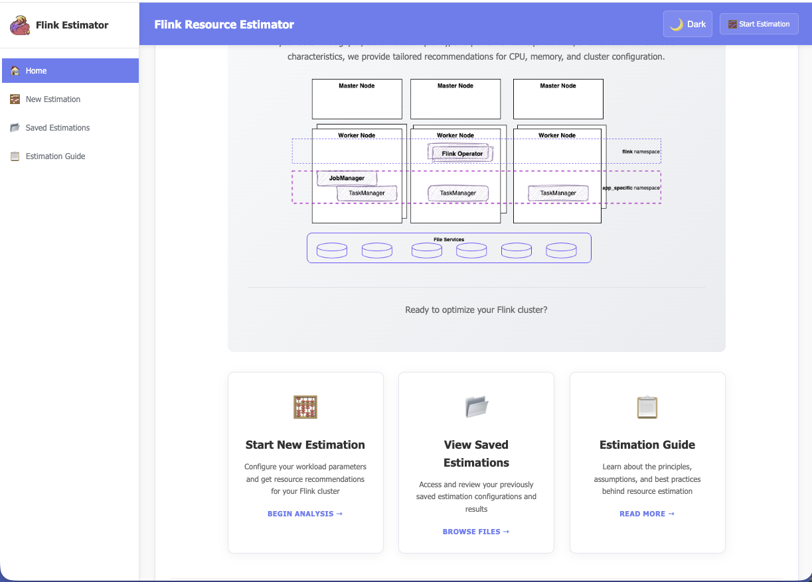

# Flink Resource Estimator

Web app (FastAPI) that estimates Apache Flink cluster resource needs from workload inputs, node shape (bare metal or VM T‑shirt sizes), and SQL complexity. It offers a home dashboard, a tabbed estimation form, an in-app **Estimation Guide**, and JSON persistence for runs.

**Interactive API reference:** with the app running, open [http://localhost:8000/docs](http://localhost:8000/docs) (the footer's “API Documentation” link goes here too). Request and response shapes are defined by `EstimationInput` and the estimation result models in [`src/flink_estimator/models.py`](src/flink_estimator/models.py).



## Features

- **Home** — three entry points: start an estimation, open saved files, or read the Estimation Guide
- **Tabbed form** — *Project & Hardware* (network, workers, memory/CPU targets; VM S/M/L auto-fills cores and RAM), *Workload* (throughput, record size, latency, keys, skew, number of applications), *Flink SQL query complexity* (simple / medium / complex counts)
- **Results** — summary and Flink-oriented recommendations; **Edit parameters and re-estimate** (reopens the form with the same values); **Save to JSON** and copy configuration snippets
- **Saved list** — download, preview, delete, and reload a saved result page
- **GET/JSON APIs** for estimate and save (see `/docs`)

## Quick start

For development. See [Docker section](#docker) for user.

**Requirements:** Python **3.11+** (see [`src/.python-version`](src/.python-version) and [`src/pyproject.toml`](src/pyproject.toml)). Use [`uv`](https://github.com/astral-sh/uv) to install and run.

```bash
cd src
uv pip install -r requirements.txt
uv run main.py
```

Open [http://localhost:8000](http://localhost:8000).

For reload during development:

```bash
cd src
uv run uvicorn main:app --reload --host 0.0.0.0 --port 8000
```

## Using the web UI

- **Home (`/`)** — same actions as the three cards: new estimation, saved files, and **Estimation Guide** (`/considerations`), which explains assumptions, baseline rules, and a TaskManager memory map
- **Configure (`/estimation-form`)** — use the three tabs, then **Calculate Resource Estimates**; you can use **Save Configuration** on the form to persist inputs (via `/save-estimation`) before or alongside a full run
- **Results (`POST /estimate`)** — use **Edit parameters and re-estimate** to return to the form with current values; **Save to JSON** stores the full input + result under `saved_estimations/` (relative to the process working directory, typically `src/saved_estimations` when you start the app from `src/`)
- **Saved (`/saved`)** — manage files; open a file’s result view via **Reload** (see `GET /reload/{filename}` below)

## API overview

- **POST `/api/estimate`** — JSON body: `EstimationInput` (all fields; VM workers require `worker_node_t_size` `S` / `M` / `L`)
- **GET `/api/estimate`** — same parameters as query strings (e.g. for quick checks with `curl`)
- **POST `/api/save-estimation`** or **POST `/save-estimation`** — run an estimate and save JSON
- **GET `/saved-estimations`** — list saved files and metadata
- **GET `/download/{filename}`** — download a saved JSON
- **DELETE `/delete-estimation/{filename}`** — remove a saved file

Example **POST** (bare-metal workers; extend or adjust fields to match your scenario):

```bash
curl -s -X POST "http://localhost:8000/api/estimate" \
  -H "Content-Type: application/json" \
  -d '{
    "project_name": "Demo",
    "messages_per_second": 10000,
    "avg_record_size_bytes": 1024,
    "number_flink_applications": 1,
    "num_distinct_keys": 100000,
    "data_skew_risk": "low",
    "bandwidth_capacity_gbps": 10,
    "expected_latency_seconds": 5.0,
    "simple_statements": 2,
    "medium_statements": 1,
    "complex_statements": 1,
    "nb_worker_nodes": 3,
    "worker_node_type": "bare_metal",
    "worker_node_memory_mb": 16384,
    "worker_node_cpu_max": 8
  }'
```

For a full list of fields, defaults, and validation rules, use `/docs` or the Pydantic models in code.

## HTML routes

| Method | Path | Purpose |
|--------|------|--------|
| GET | `/` | Home / dashboard |
| GET | `/estimation-form` | Tabbed form (query string can prefill fields) |
| GET | `/considerations` | Estimation Guide |
| GET | `/saved` | Saved files UI |
| POST | `/estimate` | Submit form → results page |
| GET | `/reload/{filename}` | Open a saved estimation as the results view |

## How the estimate is produced (brief)

The engine combines throughput, record size, statement counts (scaled by the number of Flink applications), network ceiling, latency, key cardinality and skew, and worker shape to derive memory, CPU, node counts, and example Flink config lines. The in-app **Estimation Guide** lists assumptions (e.g. baselines, checkpointing) that matter more than a short README can cover.

## Docker

The [`Dockerfile`](src/Dockerfile) and [`src/requirements.txt`](src/requirements.txt) are under **`src/`**. Build with that directory as the context:

```bash
docker build -t flink-estimator -f src/Dockerfile src
```

Run and persist estimations to a host directory (example uses a folder at the repo root):

```bash
docker run -d --name flink-estimator -p 8000:8000 \
  -v "$(pwd)/saved_estimations:/app/saved_estimations" \
  flink-estimator
```

There is a [`docker-compose.yml`](docker-compose.yml) at the **repository root**; adjust the compose `build` context if you point it at a layout where the `Dockerfile` is not visible.

## Kubernetes

From the **repository root** (where [`k8s/`](k8s/) lives):

```bash
kubectl apply -k k8s/
kubectl get pods -l app=flink-estimator
```

Tear down: `kubectl delete -k k8s/`. Access patterns (NodePort, `kubectl port-forward`, etc.) follow your cluster’s `Service` and networking setup.

## Project layout

```text
flink-estimator/
├── README.md
├── docker-compose.yml
├── k8s/                    # Kustomize manifests
├── docs/images/            # e.g. screenshot above
├── saved_estimations/        # often used for Docker / host mount (optional for local dev)
└── src/
    ├── main.py
    ├── requirements.txt
    ├── flink_estimator/      # models and estimation logic
    ├── templates/            # home, estimation, results, saved, considerations, base
    ├── static/
    ├── tests/                 # unit tests (pytest; see src/pytest.ini)
    ├── saved_estimations/   # default save dir when cwd is `src/`
    └── .python-version
```

## Development and tests

```bash
cd src
uv run pytest
```

`pytest.ini` sets `testpaths = tests` relative to the `src/` working directory (see [`src/pytest.ini`](src/pytest.ini)). Integration tests that assume a running server live under the same tree per project convention.

## Disclaimer

Estimates use simplified models. Real clusters depend on your job graph, I/O, state, skew, and operators—validate with your own load tests and monitoring.

## License

This project is licensed under the [Apache License 2.0](LICENSE).

## Contributing

Open issues and pull requests on the repository. Keep changes focused and covered by tests where it makes sense.

## Support

Use the repository issue tracker, [Apache Flink documentation](https://flink.apache.org), and the interactive help at `http://localhost:8000/docs` when the app is running.

## See [related Flink studies book](https://jbcodeforce.github.io/flink-studies/)